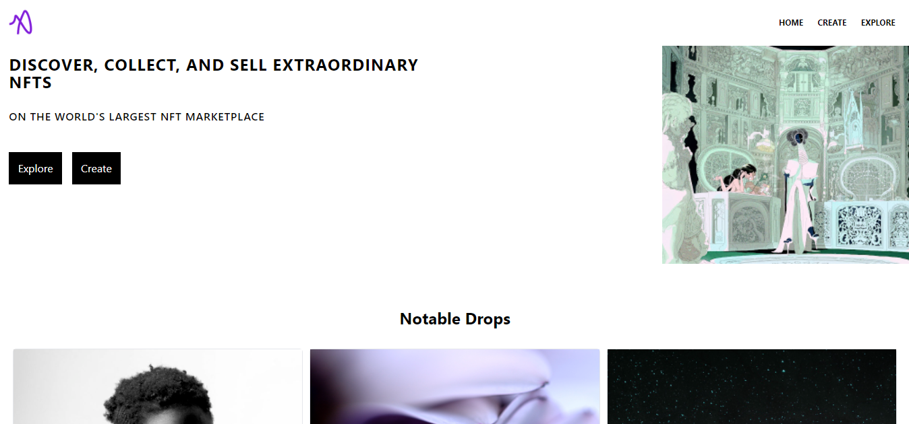
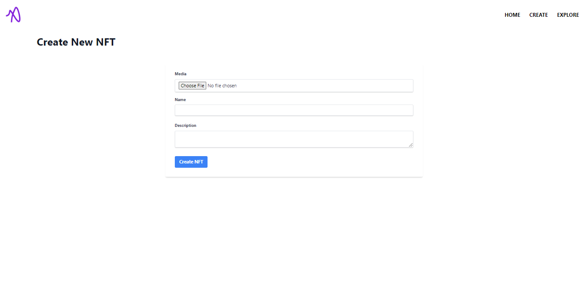

# NFT Marketplace Demosu

Vue ile geliştirilmiş örnek bir NFT marketplace.

# Nasıl Çalıştırabilirim?

Öncelikle root'ta ".secret" oluşturun. hardhat.config.js içerisindeki subnet ayarlarınızı yapın.

Frontend'i ayağa kaldırmak için "yarn serve" yapabilirsiniz. 

Basit bir şekilde netlify'de de deploy edebilirsiniz.
